# HoloMat System Block Diagram

## High-Level Architecture

```
┌────────────────────────────────────────────────────────────────────────────────┐
│                              USER INTERACTION                                   │
│     👤 User → [Voice Commands] [Hand Gestures] [Face Recognition] [Approach]   │
└────────────────────────────────────────────────────────────────────────────────┘
                                        │
                                        ▼
┌────────────────────────────────────────────────────────────────────────────────┐
│                           INPUT LAYER (Sensors)                                 │
│ ┌──────────────┐  ┌──────────────┐  ┌──────────────┐  ┌──────────────────────┐ │
│ │  Motion PIR  │  │  Gesture     │  │  Light       │  │     Camera           │ │
│ │  HC-SR501    │  │  Ultrasonic  │  │  LDR+ADC     │  │  USB 1080p Webcam    │ │
│ │  GPIO 4      │  │  3x HC-SR04  │  │  MCP3008     │  │  + Microphone        │ │
│ └──────────────┘  └──────────────┘  └──────────────┘  └──────────────────────┘ │
└────────────────────────────────────────────────────────────────────────────────┘
                                        │
                                        ▼
┌────────────────────────────────────────────────────────────────────────────────┐
│                     PROCESSING LAYER (Raspberry Pi 3B+)                         │
│ ┌──────────────────────────────────────────────────────────────────────────┐   │
│ │                         PYTHON BACKEND (FastAPI)                         │   │
│ │                                                                          │   │
│ │  ┌─────────────┐  ┌─────────────┐  ┌─────────────┐  ┌─────────────┐     │   │
│ │  │   Sensor    │  │   Vision    │  │     AI      │  │   Control   │     │   │
│ │  │   Process   │  │   Process   │  │   Process   │  │   Process   │     │   │
│ │  │   Core 1    │  │   Core 2    │  │   Core 3    │  │   Core 0    │     │   │
│ │  ├─────────────┤  ├─────────────┤  ├─────────────┤  ├─────────────┤     │   │
│ │  │ • PIR Read  │  │ • OpenCV    │  │ • Groq API  │  │ • WebSocket │     │   │
│ │  │ • Ultrasonic│  │ • Face Det. │  │ • LLM Query │  │ • REST API  │     │   │
│ │  │ • LDR Read  │  │ • Face Rec. │  │ • TTS/STT   │  │ • Events    │     │   │
│ │  │ • Gestures  │  │ • AR Track  │  │ • Commands  │  │ • Routing   │     │   │
│ │  └──────┬──────┘  └──────┬──────┘  └──────┬──────┘  └──────┬──────┘     │   │
│ │         └────────────────┴────────────────┴────────────────┘            │   │
│ │                    Python Multiprocessing Queues                         │   │
│ └──────────────────────────────────────────────────────────────────────────┘   │
│                                                                                 │
│ ┌──────────────────────────────────────────────────────────────────────────┐   │
│ │                          HARDWARE CONTROL                                │   │
│ │  ┌─────────────┐  ┌─────────────┐  ┌─────────────┐  ┌─────────────┐     │   │
│ │  │    GPIO     │  │    I2C      │  │    SPI      │  │    PWM      │     │   │
│ │  │  Manager    │  │  LCD Bus    │  │   ADC       │  │   LEDs      │     │   │
│ │  └─────────────┘  └─────────────┘  └─────────────┘  └─────────────┘     │   │
│ └──────────────────────────────────────────────────────────────────────────┘   │
└────────────────────────────────────────────────────────────────────────────────┘
                    │                                       │
          WebSocket/REST API                          Direct Hardware
                    │                                       │
                    ▼                                       ▼
┌────────────────────────────────────────────────────────────────────────────────┐
│                           OUTPUT LAYER                                          │
│ ┌──────────────────────────────────────┐  ┌──────────────────────────────────┐ │
│ │         BROWSER (Frontend)            │  │        HARDWARE OUTPUT           │ │
│ │  ┌────────────────────────────────┐  │  │  ┌─────────────┐  ┌───────────┐  │ │
│ │  │     React + TypeScript         │  │  │  │ LCD Panels  │  │ LED Strip │  │ │
│ │  │  ┌──────────┐  ┌──────────┐   │  │  │  │  20x4 I2C   │  │  WS2812B  │  │ │
│ │  │  │ Three.js │  │  Zustand │   │  │  │  │  Time/Date  │  │  RGB Glow │  │ │
│ │  │  │   3D     │  │   State  │   │  │  │  │  Status     │  │  Effects  │  │ │
│ │  │  └──────────┘  └──────────┘   │  │  │  └─────────────┘  └───────────┘  │ │
│ │  │  ┌──────────┐  ┌──────────┐   │  │  │  ┌─────────────┐  ┌───────────┐  │ │
│ │  │  │  Voice   │  │ WebSocket│   │  │  │  │   Speaker   │  │ Projector │  │ │
│ │  │  │  Panel   │  │  Client  │   │  │  │  │   3.5mm     │  │ Hologram  │  │ │
│ │  │  └──────────┘  └──────────┘   │  │  │  │   Audio     │  │  Display  │  │ │
│ │  └────────────────────────────────┘  │  │  └─────────────┘  └───────────┘  │ │
│ └──────────────────────────────────────┘  └──────────────────────────────────┘ │
└────────────────────────────────────────────────────────────────────────────────┘
```

---

## Data Flow Diagram

```
                              ┌─────────────────┐
                              │   USER SPEAKS   │
                              │  "Hey Jarvis"   │
                              └────────┬────────┘
                                       │
                                       ▼
    ┌──────────────────────────────────────────────────────────────────┐
    │                         VOICE PIPELINE                            │
    │                                                                   │
    │  [Microphone] → [Wake Word] → [Speech-to-Text] → [Groq AI LLM]  │
    │                                         │              │         │
    │                                         ▼              ▼         │
    │                               [Intent Parser] → [Action Handler] │
    └──────────────────────────────────────────────────────────────────┘
                                       │
         ┌─────────────────────────────┼─────────────────────────────┐
         │                             │                             │
         ▼                             ▼                             ▼
┌─────────────────┐         ┌─────────────────┐         ┌─────────────────┐
│  CHANGE MODEL   │         │    LED MODE     │         │     TTS SPEAK   │
│  Switch 3D      │         │   Update LEDs   │         │   Voice Output  │
│  hologram       │         │   blue/gold     │         │   to speaker    │
└────────┬────────┘         └────────┬────────┘         └────────┬────────┘
         │                           │                           │
         ▼                           ▼                           ▼
  ┌─────────────┐           ┌─────────────┐            ┌─────────────┐
  │  WebSocket  │           │  GPIO PWM   │            │  Audio Out  │
  │  → Frontend │           │  → WS2812B  │            │  → Speaker  │
  └─────────────┘           └─────────────┘            └─────────────┘
```

---

## Component Relationship Diagram

```
                          ┌──────────────────────────────────┐
                          │      HOLOMAT SYSTEM              │
                          └──────────────────────────────────┘
                                       │
         ┌─────────────────────────────┼─────────────────────────────┐
         │                             │                             │
         ▼                             ▼                             ▼
┌─────────────────┐         ┌─────────────────┐         ┌─────────────────┐
│     FRONTEND    │         │     BACKEND     │         │    HARDWARE     │
│    (Browser)    │◄───────►│  (Raspberry Pi) │◄───────►│   (Sensors)     │
└─────────────────┘         └─────────────────┘         └─────────────────┘
         │                           │                           │
         │                           │                           │
    ┌────┴────┐                 ┌────┴────┐               ┌──────┴──────┐
    │         │                 │         │               │             │
    ▼         ▼                 ▼         ▼               ▼             ▼
┌───────┐ ┌───────┐      ┌─────────┐ ┌─────────┐   ┌─────────┐   ┌─────────┐
│React  │ │Three  │      │FastAPI  │ │Database │   │ GPIO    │   │ I2C/SPI │
│+Vite  │ │.js 3D │      │Server   │ │SQLite   │   │ Sensors │   │ LCD/ADC │
└───────┘ └───────┘      └─────────┘ └─────────┘   └─────────┘   └─────────┘
    │         │               │           │             │             │
    ▼         ▼               ▼           ▼             ▼             ▼
┌───────┐ ┌───────┐      ┌─────────┐ ┌─────────┐   ┌─────────┐   ┌─────────┐
│Zustand│ │Voice  │      │WebSocket│ │Users    │   │ PIR     │   │ LCD     │
│State  │ │Panel  │      │Handler  │ │Settings │   │ Motion  │   │ Display │
└───────┘ └───────┘      └─────────┘ └─────────┘   └─────────┘   └─────────┘
                              │
                    ┌─────────┴─────────┐
                    ▼                   ▼
              ┌─────────┐         ┌─────────┐
              │ Groq AI │         │ OpenCV  │
              │   LLM   │         │  Face   │
              └─────────┘         └─────────┘
```

---

## Software Module Stack

```
┌═══════════════════════════════════════════════════════════════════════════════┐
║                              FRONTEND STACK                                    ║
╠═══════════════════════════════════════════════════════════════════════════════╣
║  PRESENTATION  │  React Components │ Screens │ CSS Animations                 ║
╟────────────────┼───────────────────────────────────────────────────────────────╢
║  3D ENGINE     │  Three.js │ React Three Fiber │ Hologram Shaders             ║
╟────────────────┼───────────────────────────────────────────────────────────────╢
║  STATE         │  Zustand Store │ WebSocket Events │ Sensor Data              ║
╟────────────────┼───────────────────────────────────────────────────────────────╢
║  VOICE         │  Web Speech API │ Groq AI Service │ TTS/STT                  ║
╚═══════════════════════════════════════════════════════════════════════════════╝
                                    │
                          WebSocket + REST API
                                    │
╔═══════════════════════════════════════════════════════════════════════════════╗
║                              BACKEND STACK                                     ║
╠═══════════════════════════════════════════════════════════════════════════════╣
║  API LAYER     │  FastAPI Server │ REST Routes │ WebSocket Handler            ║
╟────────────────┼───────────────────────────────────────────────────────────────╢
║  PROCESS LAYER │  Sensor Core │ Vision Core │ AI Core │ Control Core         ║
╟────────────────┼───────────────────────────────────────────────────────────────╢
║  AI LAYER      │  Groq API │ Whisper STT │ pyttsx3 TTS │ Command Parser       ║
╟────────────────┼───────────────────────────────────────────────────────────────╢
║  VISION LAYER  │  OpenCV │ face_recognition │ MediaPipe (optional)            ║
╟────────────────┼───────────────────────────────────────────────────────────────╢
║  HARDWARE      │  GPIO │ I2C │ SPI │ USB │ PWM │ Audio                        ║
╚═══════════════════════════════════════════════════════════════════════════════╝
```

---

## Priority Phases Block Diagram

```
┌─────────────────────────────────────────────────────────────────────────────┐
│                            IMPLEMENTATION PHASES                             │
├─────────────────────────────────────────────────────────────────────────────┤
│                                                                             │
│  PHASE 1 (P1) - Core Software ━━━━━━━━━━━━━━━━━━━━━━━━━━━━━━━━━━━━━━━━━━━━ │
│  ┌────────────────┐ ┌────────────────┐ ┌────────────────┐ ┌──────────────┐ │
│  │ Backend API    │ │ WebSocket      │ │ Dashboard      │ │ Gesture      │ │
│  │ FastAPI        │ │ Client         │ │ Screen         │ │ Control (SW) │ │
│  │ ■■■■■■■■□□□□   │ │ ■■□□□□□□□□□□   │ │ ■■■□□□□□□□□□   │ │ ■■■□□□□□□□□□ │ │
│  └────────────────┘ └────────────────┘ └────────────────┘ └──────────────┘ │
│                                                                             │
│  PHASE 2 (P2) - 3D & Visualization ━━━━━━━━━━━━━━━━━━━━━━━━━━━━━━━━━━━━━━━ │
│  ┌────────────────┐ ┌────────────────┐ ┌────────────────┐ ┌──────────────┐ │
│  │ 3D File Loader │ │ Blender        │ │ Camera 3D      │ │ Unity        │ │
│  │ GLTF/OBJ       │ │ Integration    │ │ Rendering      │ │ (Optional)   │ │
│  │ ■■■■■■□□□□□□   │ │ ■■□□□□□□□□□□   │ │ ■■□□□□□□□□□□   │ │ □□□□□□□□□□□□ │ │
│  └────────────────┘ └────────────────┘ └────────────────┘ └──────────────┘ │
│                                                                             │
│  PHASE 3 (P3) - AI & Voice ━━━━━━━━━━━━━━━━━━━━━━━━━━━━━━━━━━━━━━━━━━━━━━━ │
│  ┌────────────────────────────────┐ ┌────────────────────────────────────┐ │
│  │ Jarvis Enhancements            │ │ AI 3D Generation                   │ │
│  │ Wake Word, System Commands     │ │ Shap-E, Text-to-3D                 │ │
│  │ ■■■■■□□□□□□□□□□□□□□□□□□□□□□□□ │ │ ■■□□□□□□□□□□□□□□□□□□□□□□□□□□□□□□ │ │
│  └────────────────────────────────┘ └────────────────────────────────────┘ │
│                                                                             │
│  PHASE 4 (P4) - Hardware (Later) ━━━━━━━━━━━━━━━━━━━━━━━━━━━━━━━━━━━━━━━━━ │
│  ┌──────────┐ ┌──────────┐ ┌──────────┐ ┌──────────┐ ┌──────────┐ ┌──────┐│
│  │ PIR      │ │ LDR      │ │ Gesture  │ │ Face     │ │ LCD      │ │ LED  ││
│  │ Motion   │ │ Light    │ │ Sensors  │ │ Auth HW  │ │ Panels   │ │Strip ││
│  │ □□□□□□□□ │ │ □□□□□□□□ │ │ □□□□□□□□ │ │ □□□□□□□□ │ │ □□□□□□□□ │ │□□□□□□││
│  └──────────┘ └──────────┘ └──────────┘ └──────────┘ └──────────┘ └──────┘│
│                                                                             │
└─────────────────────────────────────────────────────────────────────────────┘

Legend: ■ = Implemented   □ = Pending
```

---

## Image Generation Prompt

Use this prompt to generate a visual block diagram with an AI image generator (DALL-E, Midjourney, etc.):

```
Create a professional technical system architecture diagram for "HoloMat - Iron Man IoT Workstation" with the following components:

STYLE:
- Dark background (#1A1A2E) with glowing cyan (#00D4FF) and gold (#FFD700) accents
- Iron Man / Tony Stark aesthetic with holographic effects
- Clean, futuristic tech diagram style with subtle grid pattern
- Neon glow effects on connections and nodes

MAIN BLOCKS (Top to Bottom):

1. USER LAYER (Top):
   - Icons: Person silhouette, voice waves, hand gesture, camera eye
   - Label: "User Interaction"

2. INPUT SENSORS (Left side):
   - Block 1: PIR Motion Sensor (antenna icon)
   - Block 2: 3x Ultrasonic Sensors (wave pattern)
   - Block 3: Light Sensor (sun icon)
   - Block 4: Camera + Microphone (camera and mic icons)
   - Label: "Sensors"

3. CENTRAL PROCESSING (Center - Large block):
   - Title: "Raspberry Pi 3B+" with Pi logo
   - 4 inner cores: Sensor, Vision, AI, Control
   - Multiprocessing queues connecting them
   - FastAPI server icon
   - Label: "Backend Server"

4. OUTPUT LAYER (Right side + Bottom):
   - Browser/Frontend (React + Three.js icons)
   - LCD Displays (text panels)
   - LED Strip (RGB glow)
   - Speaker (audio waves)
   - Projector/Hologram (3D cube icon)
   - Label: "Outputs"

5. CLOUD/API (Top right corner, small):
   - Groq AI logo
   - OpenAI logo
   - Label: "AI Services"

CONNECTIONS:
- Glowing cyan lines connecting all components
- Arrows showing data flow direction
- WebSocket symbol between Pi and Browser
- GPIO/I2C/SPI labels on hardware connections

TEXT:
- Title at top: "HOLOMAT SYSTEM ARCHITECTURE"
- Clean, futuristic sans-serif font
- All labels in white or cyan
```

---

## Mermaid Diagram (for Markdown Rendering)

```mermaid
graph TB
    subgraph USER["👤 User Interaction"]
        Voice["Voice Commands"]
        Gesture["Hand Gestures"]
        Face["Face Recognition"]
        Motion["Approach Detection"]
    end

    subgraph SENSORS["📡 Sensors"]
        PIR["PIR Motion<br/>HC-SR501"]
        Ultra["Ultrasonic x3<br/>HC-SR04"]
        LDR["Light Sensor<br/>LDR+MCP3008"]
        Cam["Camera<br/>USB 1080p"]
        Mic["Microphone<br/>USB"]
    end

    subgraph BACKEND["🖥️ Raspberry Pi Backend"]
        subgraph PROCESSES["Multiprocessing"]
            Sensor["Sensor<br/>Process<br/>Core 1"]
            Vision["Vision<br/>Process<br/>Core 2"]
            AI["AI<br/>Process<br/>Core 3"]
            Control["Control<br/>Process<br/>Core 0"]
        end
        FastAPI["FastAPI Server"]
        WebSocket["WebSocket"]
        REST["REST API"]
    end

    subgraph CLOUD["☁️ Cloud Services"]
        Groq["Groq AI<br/>LLM"]
        OpenCV["OpenCV<br/>face_recognition"]
    end

    subgraph FRONTEND["🌐 Browser Frontend"]
        React["React + Vite"]
        ThreeJS["Three.js<br/>3D Rendering"]
        Zustand["Zustand<br/>State"]
        VoicePanel["Jarvis<br/>Voice Panel"]
    end

    subgraph OUTPUT["📺 Hardware Output"]
        LCD["LCD Panels<br/>20x4 I2C"]
        LED["LED Strip<br/>WS2812B"]
        Speaker["Speaker<br/>3.5mm"]
        Projector["Projector<br/>Hologram"]
    end

    Motion --> PIR
    Gesture --> Ultra
    Voice --> Mic
    Face --> Cam

    PIR --> Sensor
    Ultra --> Sensor
    LDR --> Control
    Cam --> Vision
    Mic --> AI

    Sensor --> FastAPI
    Vision --> FastAPI
    AI --> FastAPI

    FastAPI --> WebSocket
    FastAPI --> REST
    AI --> Groq
    Vision --> OpenCV

    WebSocket --> React
    React --> ThreeJS
    React --> Zustand
    React --> VoicePanel

    Control --> LCD
    Control --> LED
    AI --> Speaker
    ThreeJS --> Projector

    style BACKEND fill:#16213E,stroke:#00D4FF
    style FRONTEND fill:#16213E,stroke:#FFD700
    style SENSORS fill:#1A1A2E,stroke:#00D4FF
    style OUTPUT fill:#1A1A2E,stroke:#00FF88
    style CLOUD fill:#1A1A2E,stroke:#FF6B00
```


